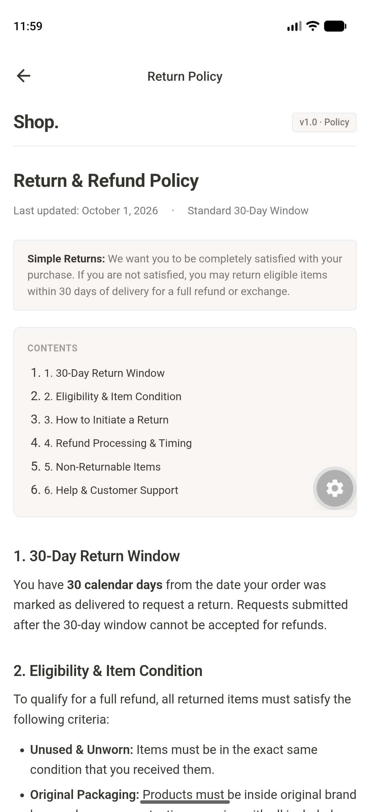

# Shop — Nua React Native Assignment

A React Native e-commerce application built with Expo (SDK 57), TypeScript, and Zustand for the Nua mobile take-home assignment.

Repository: [https://github.com/softwaredevX/nua-test-task](https://github.com/softwaredevX/nua-test-task)

---

## Screenshots & Demo

| Product Catalog | Debounced Search | Product Details | Shopping Cart | Return Policy (WebView) |
| :---: | :---: | :---: | :---: | :---: |
|  |  |  |  |  |

### Video Walkthrough

A complete end-to-end screen recording walkthrough demonstrating catalog pagination, debounced search, product details, offline WebView return policy, and cart management:

- **[Watch Walkthrough Video (app_demo.mp4)](https://github.com/softwaredevX/nua-test-task/blob/main/assets/screenshots/app_demo.mp4)**

---

## Features

- **Product Catalog**: Infinite scroll pagination (20 items/page) using DummyJSON API, pull-to-refresh, skeleton loaders, and empty/error states.
- **Debounced Search**: 300ms debounce with `AbortController` and monotonic request IDs to prevent out-of-order race conditions.
- **Product Details**: Image carousel, ratings, brand/stock info, and discount price calculation.
- **Cart Management**: Zustand store persisted via AsyncStorage with item quantity controls and real-time subtotal calculation.
- **Return Policy**: In-app offline WebView rendering bundled HTML/CSS with zero network latency.
- **Resilience & Analytics**: Exponential backoff retry with abort signal support and local event telemetry logger.

---

## Tech Stack

- **Framework**: React Native 0.86 / Expo SDK 57 (New Architecture)
- **Language**: TypeScript (strict mode)
- **Navigation**: React Navigation (Native Stack)
- **State Management**: Zustand 5 + AsyncStorage persistence
- **Styling**: StyleSheet with centralized design tokens
- **Testing**: Jest + React Native Testing Library

---

## Project Structure

```
src/
├── components/          # Shared UI (SearchBar, StateViews: Loading, Empty, Error)
├── config/              # Environment config with safe defaults
├── features/
│   ├── products/        # Product list, details, hooks, and API client
│   ├── cart/            # Cart screen and Zustand store
│   └── webview/         # Offline Return Policy WebView screen & HTML
├── navigation/          # Native stack navigation setup
├── services/            # Storage wrapper and telemetry event logger
├── theme/               # Design tokens (colors, typography, spacing)
├── utils/               # Discount math and retry utilities (tested)
└── hooks/               # Custom hooks (e.g. useDebounce)
```

---

## Key Technical Decisions

- **State Management**: Zustand was chosen for minimal boilerplate, granular selectors (avoiding unnecessary re-renders), and built-in async storage persistence.
- **Search Race Prevention**: Fast typing can cause responses to return out of order. Mitigated using a 300ms debounce, `AbortController` to cancel pending requests, and monotonic request IDs (`fetchIdRef`) to drop stale responses.
- **Offline Return Policy**: Bundled directly as local HTML in `src/features/webview/constants/returnPolicyHtml.ts` so the WebView loads instantly without depending on external network availability.

---

## Getting Started

### Prerequisites
- Node.js >= 18
- npm or bun

### Setup

```bash
# Clone the repository
git clone https://github.com/softwaredevX/nua-test-task.git
cd nua-test-task

# Install dependencies
npm install

# Start development server
npm start
```

Run on your target platform:
```bash
npm run ios       # iOS Simulator
npm run android   # Android Emulator
```

---

## Testing

```bash
# Run unit tests
npm test

# Type checking
npm run typecheck
```

Unit test suites cover:
- Exponential retry logic, abort signal cancellation, and 4xx bypass
- Price discount calculations, edge cases, and currency formatting
- Search monotonic request ID discard logic

---

## Builds & Artifacts

### Android Standalone Release APK
A release APK has been built:
- **Location**: [`android/app/build/outputs/apk/release/app-release.apk`](./android/app/build/outputs/apk/release/app-release.apk)
- **Install on Device/Emulator**:
  ```bash
  adb install -r android/app/build/outputs/apk/release/app-release.apk
  ```
- **Build from source**:
  ```bash
  cd android && ./gradlew assembleRelease
  ```

### iOS
- **Simulator**:
  ```bash
  npx expo run:ios
  ```
- **Production IPA**:
  Requires an active Apple Developer certificate via EAS:
  ```bash
  npx eas-cli build --platform ios --profile preview
  ```

---

## License

MIT
